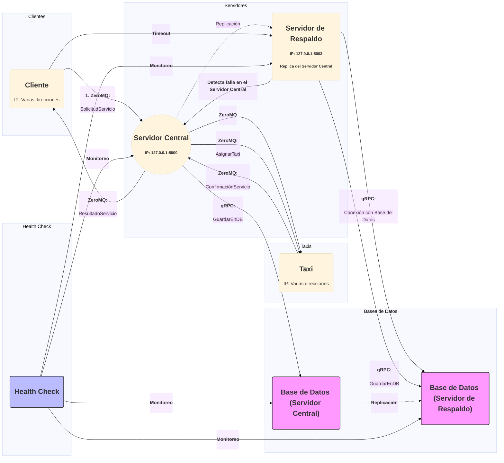
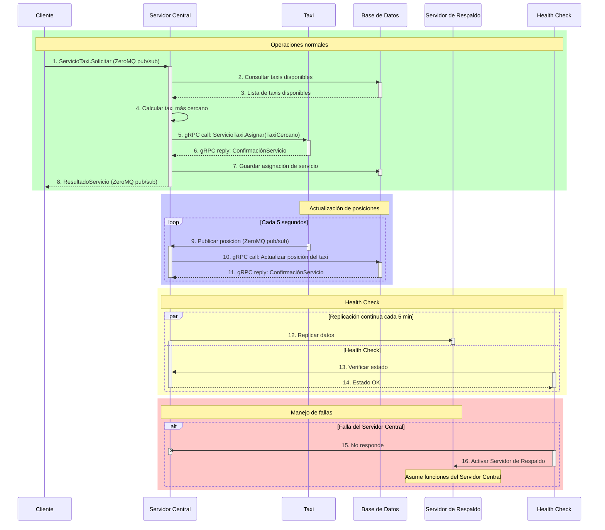

Aquí tienes una versión mejorada de tu documento para MyUber, con un enfoque más claro, uso de emojis y una estructura organizada que facilita la lectura. Además, he incluido el diagrama en Mermaid para que puedas visualizar la arquitectura del sistema de manera efectiva.

---

# 🚖 MyUber - Sistema Distribuido de Gestión de Taxis

## 📝 Descripción
**MyUber** es un sistema distribuido para la gestión de servicios de taxi que utiliza una arquitectura basada en microservicios, implementando **gRPC** y **ZeroMQ**. Este sistema permite la comunicación en tiempo real entre taxis y clientes, gestión de ubicaciones, asignación de servicios y seguimiento de métricas.

## 🏗️ Arquitectura del Sistema

### 🔑 Componentes Principales
1. **Servidor Central (`servidor.py`)**
   - Gestiona la comunicación entre clientes y taxis.
   - Implementa servicios gRPC para la gestión de datos.
   - Maneja la lógica de asignación de servicios.

2. **Gestor de Base de Datos (`gestor_db.py`)**
   - Maneja todas las operaciones de persistencia.
   - Almacena información de taxis, servicios y ubicaciones.
   - Proporciona estadísticas del sistema.

3. **Broker de Mensajería (`broker.py`)**
   - Implementa el patrón publicador/suscriptor con ZeroMQ.
   - Gestiona la comunicación asíncrona entre componentes.
   - Incluye un broker de respaldo para alta disponibilidad.

4. **Cliente (`cliente.py`)**
   - Interfaz para solicitar servicios de taxi.
   - Se comunica a través del broker de mensajería.
   - Recibe actualizaciones en tiempo real.

5. **Taxi (`taxi.py`)**
   - Gestiona el estado y ubicación de cada taxi.
   - Recibe y procesa asignaciones de servicios.
   - Actualiza su posición periódicamente.

### 📊 Diagrama de Arquitectura

### 🌐 Diagrama de Secuencia


## 📦 Dependencias

### 🖥️ Requisitos del Sistema
- Python 3.8 o superior
- CockroachDB (para la base de datos)

### 📚 Bibliotecas Python
```bash
# Instalar dependencias
pip install grpcio==1.54.2
pip install grpcio-tools==1.54.2
pip install psycopg2-binary==2.9.6
pip install pyzmq==25.1.1
pip install protobuf==4.23.1
```

## ⚙️ Configuración

### 1. Base de Datos
1. Crear una base de datos en CockroachDB.
2. Ejecutar el script de inicialización:

```sql
CREATE TABLE taxis (
    taxi_id UUID PRIMARY KEY,
    status TEXT,
    last_update TIMESTAMP,
    total_services INT DEFAULT 0,
    successful_services INT DEFAULT 0
);

CREATE TABLE taxi_locations (
    location_id UUID PRIMARY KEY DEFAULT gen_random_uuid(),
    taxi_id UUID REFERENCES taxis(taxi_id),
    latitude FLOAT,
    longitude FLOAT,
    timestamp TIMESTAMP DEFAULT CURRENT_TIMESTAMP
);

CREATE TABLE services (
    service_id UUID PRIMARY KEY DEFAULT gen_random_uuid(),
    client_id UUID,
    taxi_id UUID REFERENCES taxis(taxi_id),
    status TEXT,
    request_timestamp TIMESTAMP,
    completion_timestamp TIMESTAMP,
    client_latitude FLOAT,
    client_longitude FLOAT,
    taxi_latitude FLOAT,
    taxi_longitude FLOAT
);
```

### 2. Configuración de Servicios
1. Actualizar las credenciales de la base de datos en `gestor_db.py`.
2. Configurar los puertos en `broker.py`.
3. Ajustar las direcciones IP/puertos en `servidor.py`.

## ▶️ Ejecución

### 1. Iniciar los Servicios Base
```bash
# Iniciar el Gestor de Base de Datos
python gestor_db.py

# Iniciar el Broker de Mensajería
python broker.py

# Iniciar el Servidor
python servidor_principal.py
```

### 2. Iniciar Clientes y Taxis
```bash
# Iniciar un nuevo taxi
python taxi.py

# Iniciar un nuevo cliente
python usuario.py
```

## 📈 Monitoreo y Estadísticas

El sistema proporciona estadísticas en tiempo real sobre:
- 📊 Número total de servicios
- ✅ Servicios completados y denegados
- 📍 Posiciones históricas de taxis
- 📊 Métricas por taxi
- 🔍 Estado del sistema

Para acceder a las estadísticas, utilizar el método `GetStatistics` del servicio gRPC.

## 🧪 Pruebas
Para ejecutar las pruebas del sistema:
```bash
python -m unittest discover tests
```

## 🔒 Consideraciones de Seguridad
- Las credenciales de la base de datos deben ser manejadas como variables de entorno.
- Implementar autenticación para las comunicaciones gRPC.
- Usar SSL/TLS para las conexiones.
- Validar y sanitizar todas las entradas de usuario.

## 🤝 Contribución
1. Fork del repositorio.
2. Crear una rama para la nueva característica.
3. Commit de los cambios.
4. Push a la rama.
5. Crear un Pull Request.

## 📄 Licencia
Este proyecto está bajo la licencia MIT. Ver el archivo `LICENSE` para más detalles.

## 📬 Contacto
Para preguntas o sugerencias, por favor abrir un issue en el repositorio.

---

Si necesitas realizar más ajustes o incluir información adicional, ¡házmelo saber!